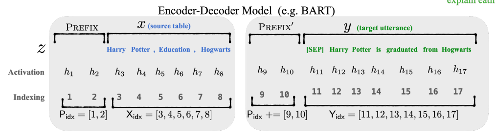

# OpenPrompt 自制使用手册

整理人：陈皓_10205102429

### 1.参考文献及使用文档

**文献**：OpenPrompt: An Open-source Framework for Prompt-learning

**文献链接**：https://arxiv.org/abs/2111.01998

**文档网址**：https://thunlp.github.io/OpenPrompt/index.html

### 2. Base Class

#### 2.1 概述

Base Class部分给出的是prompt learning架构的基础。

对于prompt learning，首先需要根据对应的<u>预训练任务</u>，选择一个现有的<u>预训练语言模型</u>。

`Template`类用来建立一个方法，该方法对于初始文本进行包装，使其对应于模型的训练任务。

`Verbalizer`类用来将标签定义到词表中的标签词中。

该代码框架下，后续的类都会继承这些基础的类。

#### 2.2 Prompt Base

##### ①`Template`

**父类：**`torch.nn`

**作用：**构造模板，对于输入的原始文本进行包装，使下游任务适用于预训练语言模型的格式。

**子类：**

**1）初始化参数**

| 名称                | 解释说明                                                     |
| ------------------- | ------------------------------------------------------------ |
| tokenizer           | 用于将输入转化成token  类型为`PreTrainedTokenizer`      |
| placeholder_mapping | 用于作原始文本中占位符到token的映射。 例子：**dict** = {'<text_a>':'text_a','<text_b>':'text_b'}, |

**2）类内成员变量**

| 名称               | 解释说明                                      |
| ------------------ | --------------------------------------------- |
| tokenizer          | 见初始化参数                                  |
| placehoder_mapping | 见初始化参数                                  |
| _in_on_text_set    | 作为一个对text进行设置的开关，默认为**False** |
| mixed_token_start  | 用于标识token的起点，默认为字符"{"            |
| mixed_token_end    | 用于标识token的终点，默认为字符"}"            |
| text               | 模板文本                                      |

**3）类内函数**

| 名称                              | 解释说明                                                     |
| --------------------------------- | ------------------------------------------------------------ |
| **\_init\_()**                    | **说明**：类的初始化，类内变量赋值                           |
| **get_default_loss_ids()**        | **返回**：List **说明**：这个List标识出模板中哪个位置的token被掩盖掉。 列表中取值为0和1，0表示正常的序列token，1表示masked token |
| **get_default_shortenable_ids()** | **返回**：List **说明**：为了适应模型的max_sequence_length，模板中也要有可伸缩的token。 默认情况下，input text是可伸缩的，而剩余部分需要保持固定。 所以列表中，1表示input tokens，0表示template sequence token。 |
| **get_default_soft_token_ids()**  | **返回**：List **说明**：辨别哪些token是soft token，一般由子类接续编写。 |
| **incorporate_text_example(·)**   | **参数**：①example：类型为`InputExample` ②text：输入文本，默认为None **返回**：text **说明**：用于将`InputExample`和模板的text进行合并操作，统一为text的形式 |
| **_check_template_format()**      | **说明**：检查template的格式是否正确，主要判断mask tokens的个数是否为0。 |
| **parse_text(·)**                 | **参数**：①text：输入文本 **返回**：List。名称为parsed，存放将text语法分析的结果 **说明**：对文本进行语法分析 |
| **wrap_one_example(·)**           | **参数：**①example：类型为`InputExample` **返回**：List[Dict]，将模板文本中的每一个token都转化成字典表示 示例：[{"loss_ids": 0, "text": "It was"}, {"loss_ids": 1, "text": "\<mask\>"}, ] |
| **process_batch**                 | 用于对batch操作的一个方法，需要用到的时候由子类完成续写      |
| **post_processing_outputs()**     | **参数**：①outputs **返回**：outputs **说明**：根据模板的需要对语言模型的输出进行后处理，由子类完成续写。 |
| **save(·)**                       | **参数**：path **说明**：根据指定的路径保存`Template`   |
| **text**                          | 写作property，对文本赋值进行一些安全性的检查和设置           |
| **on_text_set**                   | 若在template文本被设置的同时需要完成操作，在子类中写这个函数 |
| **from_file(·)**                  | **参数**：①path:原始文本文件对应的路径 ②choice：`int`型，默认为0，表示读第几行 **说明**：将文本文档中的内容读入，并存放到类中的text当中。 |
| **from_config(·）**               | 从configuration node中加载一个template                       |

##### ②`Verbalizer`

父类：`torch.nn`

**作用**：完成模型输出词语到对应的类别之间的映射。

**1）初始化参数**

| 名称        | 解释说明                                                  |
| ----------- | --------------------------------------------------------- |
| tokenizer   | 将单词转化成token的工具，常常从预训练语言模型里面load出来 |
| classes     | 存储输入数据的类别                                        |
| num_classes | 存储输入数据的类别数                                      |

**2）类内函数**

| 名称                            | 解释说明                                                     |
| ------------------------------- | ------------------------------------------------------------ |
| **label_words**                 | label words表示被特定的标签所投影到的词语集合。 如：positive$\rightarrow${wonderful,good},那么wonderful和good就是label words 做成了@property,在设置后自动调用函数**on_label_words_set()** |
| **generate_parameters()**       |                                                              |
| **register_calibrate_logits()** |                                                              |
| **process_outputs()**           | 默认情况下，verbalizer的输出就是预训练语言模型的输出。根据不同继承的子类，再编写不同的得到输出的方式 |
| **gather_outputs()**            |                                                              |
| **aggregate**                   |                                                              |
| **normalize**                   |                                                              |
| **project**                     |                                                              |
| **handle_multi_token**          |                                                              |
| **from_config**                 |                                                              |
| **from_file**                   | 从verbalizer文本文件中对类对象进行一个初始化                 |

#### 2.3 Pipeline Base

##### ①`PromptDataLoader`

**作用**：将用于prompt model的数据集进行一个包装

##### ②`PromptModel`

**父类：**`nn.Modules`

**作用：**在Openprompt的框架下将Template和transformers库的PretrainedModel进行了封装，使其构成一个Prompt的模型

**子类：**

+ PromptForClassification
+ PromptForGeneration

**1）初始化参数**

| 名称          | 解释说明                                                     |
| ------------- | ------------------------------------------------------------ |
| plm           | **自行传入**，类型为`PreTrainedModel`，传入预训练语言模型    |
| template      | **自行传入**，类型为`Template`，即构成prompt的一个模板       |
| freeze_plm    | 默认为False                                                  |
| plm_eval_mode | 默认为False。（上两点为一些特定参数的冻结，正常使用情况下无需传参） |

**2）类内函数**

| 名称                           | 解释说明                                                     |
| ------------------------------ | ------------------------------------------------------------ |
| **\_init\_()**                 | 初始化赋值，获取预训练语言模型的参数。随后执行**_prepare_main_input_name()** |
| **_prepare_main_input_name()** | 对类内变量main_input_name根据不同情况进行赋值                |
| **forward()**                  | **参数**：①batch，为 **Union**[Dict, InputFeatures] **返回**：`torch.Tensor` **说明**：从模板中提取出input batch，随后喂给plm得到output，并将output交由Template处理过一次后返回最终的output。 （forward函数制定前向传播的规则，用于预测mask tokens的值） |

##### ③`PromptForClassification`

**父类：**`PromptModel`

**说明**：本类在`PromptModel`的基础上加入了一个用于分类的头部，这个头部会通过Verbalizer，将输出映射到类别上

**1）初始化参数**

| 名称          | 解释说明                                                     |
| ------------- | ------------------------------------------------------------ |
| plm           | **自行传入**，为`PretrainedModel`类，为在transformers库中选择的预训练模型 |
| template      | **自行传入**，为`Template`类，是prompt模型当中预先设置的模板 |
| verbalizer    | **自行传入**，为`Verbalizer`类，用于作输出label words到label的映射 |
| freeze_plm    | 表示是否冻结预训练语言模型的所有参数，默认为False            |
| plm_eval_mode | 更强力的freeze，会将dropout一起冻结，默认为False             |

**2）类内函数**

| 名称                  | 解释说明                                                     |
| --------------------- | ------------------------------------------------------------ |
| **\_init\_()**        | 利用传入的参数进行赋值，如使用plm和template定义一个`PromptModel` 随后比prompt模型多添置一个Verbalizer，用于标签转化 |
| **extract_at_mask()** | **参数**：①outputs（`torch.Tensor`）：为初始的输出（可能来自于Verbalizer) ②batch(Union[`Dict`,`InputFeatures`])：为初始的batch **返回**：outputs，为所有mask token的输出 **说明**：主要用于将Verbalizer的输出分析称mask token的输出，作为一种方法用于前向传播函数当中 |
| **forward()**         | 主要过程是将batch喂给预训练语言模型，随后将模型的输出喂给verbalizer,最后将verbalizer的输出分析成每个词语的输出（前向传播） |

##### ④`PromptForGeneration`

### 3.Template

**简介**：模板是prompt-learning中最重要的模块之一，它将原始的输入进行封装和处理

#### 3.1 Manual Template

##### ①`ManualTemplate`

**父类：**`Template`   ([链接](#####①`Template`))

**作用：**该类表示手动构建模板，基本上沿用了父类的架构，没有太大的区别。（一般而言，无特殊要求用这种形式的模板即可）	

**子类：**

**1）初始化参数**

| 名称                | 解释说明                                                     |
| ------------------- | ------------------------------------------------------------ |
| tokenizer           | 用于将输入转化成token  类型为`PreTrainedTokenizer`      |
| placeholder_mapping | 用于作原始文本中占位符到token的映射。 例子：**dict** = {'<text_a>':'text_a','<text_b>':'text_b'}, |
| text                | 也可在初始化的时候传入text对template的模板进行规定 （一般采用from_file的方法） |

**2）类内函数**

| 名称            | 解释说明                                                     |
| --------------- | ------------------------------------------------------------ |
| **\_init\_**()  | 调用父类的初始化函数，若传入text，则对text进行赋值           |
| **on_text_set** | 调用父类的**parse_text()**函数，在文本被设定的同时进行语法分析 |

#### 3.2 Prefix Template

##### ①`PrefixTuningTemplate`

**父类**：`Template`   ([链接](#####①`Template`))

**作用**：实现了prefix-tuning方法中的模板编写。

**参考文献**：[Prefix-Tuning: Optimizing Continuous Prompts for Generation](https://arxiv.org/abs/2101.00190)

我的图片

**1）初始化参数**

| 名称                          | 解释说明                                                     |
| ----------------------------- | ------------------------------------------------------------ |
| model                         | **自行传入**，为`PreTrainedModel`类。（用于将model内的一些参数传入进来） |
| tokenizer                     | **自行传入**，为`PreTrainedTokenizer`                        |
| mapping_hook                  |                                                              |
| text                          |                                                              |
| num_token                     | 作为前缀的token长度                                          |
| placeholder_mapping           |                                                              |
| prefix_dropout                |                                                              |
| mid_dim                       |                                                              |
| using_encoder_past_key_values |                                                              |
| using_decoder_past_key_values |                                                              |

**2）类内函数**

| 名称                              | 解释说明                                                     |
| --------------------------------- | ------------------------------------------------------------ |
| **\_init\_**()                    | 调用父类的初始化函数，若传入text，则对text进行赋值           |
| **on_text_set()**                 | 文本被安置上之后被自动调用 调用父类的**parse_text()**函数进行语义分析。 随后调用自身定义的**generate_parameters()**用于生成参数 |
| **get_past_key_values**           | 返回上一个时刻的键值对                                       |
| **generate_parameters**           |                                                              |
| **wrap_one_example**              |                                                              |
| **expand_to_batchsize**           |                                                              |
| **expand_to_batchsize_for_layer** |                                                              |
| **process_batch**                 |                                                              |
| **modify_plm**                    | （仅当T5模型的时候要modify）                                 |

(未整理完毕)

#### 3.3 Ptuning Template

##### ①`PtuningTemplate`

#### 3.4 PTR Template

##### ①`PTRTemplate`

#### 3.5 Mixed Template

##### ①`MixedTemplate`

### 4. Verbalizer

#### 4.1 One to One Verbalizer

##### ①`One2oneVerbalizer`

#### 4.2 Manual Verbalizer

##### ①`ManualVerbalizer`

#### 4.3 Automatic Verbalizer

##### ①`AutomaticVerbalizer`

#### 4.4 Knowledgeable Verbalizer

##### ①`KnowledgeableVerbalizer`

#### 4.5 PTR Verbalizer

##### ① `PTRVerbalizer`

#### 4.6 Generation Verbalizer

##### ①`GenerationVerbalizer`

#### 4.7 Soft Verbalizer

##### ① `SoftVerbalizer`

add something
